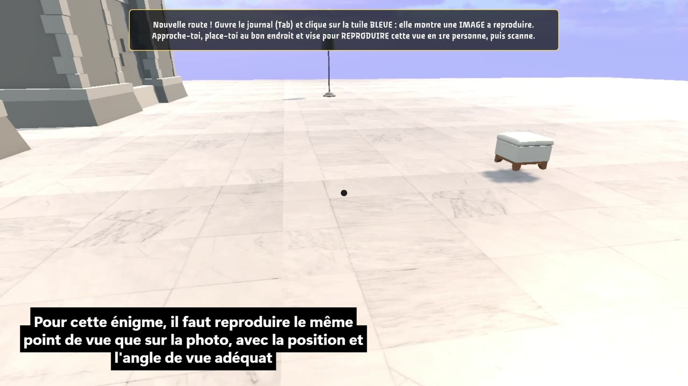

# Escape Game — Marjane

Un escape game réalisé avec Unity 6, dans lequel le joueur explore un supermarché, résout des énigmes et collecte les lettres d'un mot de passe pour accéder aux coffres.

## Démonstration

La vidéo complète est disponible en version allégée 720p. Cliquez sur l'aperçu pour récupérer le MP4 et le lire dans votre lecteur vidéo. GitHub ne propose pas d'aperçu intégré pour ce fichier.

## Le jeu

- Exploration à la troisième personne, avec bascule en vue FPS via la touche **C**.
- Routes générées au lancement de la scène principale à partir d'un pool d'indices, d'énigmes et d'emplacements.
- Journal de progression pour consulter les étapes et les indices.
- Récompenses de fin de route : lettres et bonus, dont le Déchiffreur, le Résolveur et le PathFinder.
- Tutoriel guidé dans une scène dédiée avant l'accès au jeu principal.

## Ouvrir le projet

1. Installez **Git LFS**, puis clonez ce dépôt et exécutez `git lfs pull` pour récupérer les assets.
2. Ajoutez le dossier du projet dans Unity Hub et ouvrez-le avec **Unity 6000.3.9f1**.
3. Ouvrez `Assets/Scenes/Tutorial.unity` et lancez le mode Play pour suivre le tutoriel. Pour accéder directement au jeu principal, ouvrez `Assets/Scenes/SampleScene.unity`.

Les scripts du jeu sont regroupés dans `Assets/Scripts/` : génération des routes, énigmes, inventaire, bonus, journal et contrôles du joueur.
